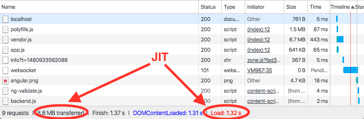
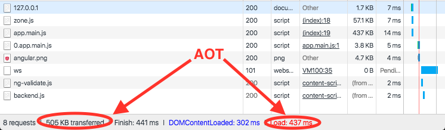

**@update: Updated the [repo](https://github.com/daniele-zurico/webpack-aot) with webpack 2.2 angular 2.4.3 and ngtools 1.2.3**

Most of you have already heard about 'AOT and lazy loading' and you're struggling, without success, to setup it. I’ll show you how to configure it and, if you’re really curious or you’re learning angular2, some technical details about AOT (at least you read the article top-bottom).

However, before going in depth, I want to share with you a screenshot

 JIT compilation

 AOT Compilation

You impressed right? Ok let's start with the **package.json:**

\[gist id ="8c06bd89bc9eecc93bcf44bdcc610cf8"\]

nothing special here apart  line 22: "@ngTools/webpack". This is THE webpack plugin that allows us to compile in AOT mode with webpack.

The second step is the creation of **webpack.config.js**:

\[gist id ="4f787b7d7b675574a5e009678aad1b43"\]

The most important lines are:

- Line 1 where we define the **@ngtools/webpack**;
- Line 16 where we use it defining the tsconfig to use;
- Line 41 where we define the loader

The last configuration file is the **tsconfig.json** file:

\[gist id ="4adefb2cbaa822c12b5b69254019f94c"\]

It's a normal tsconfig file, however the real differences are:

- line 4 where we define **moduleResolution: node**
- line 21 where we define the **entryModule **

Let's write some code now. Firstly we need the main module **main.aot.ts**, called _entryModule_ in the tsconfig.json (line 21) and _entry_ in package.json (line 9).

\[gist id ="c44aa749a8e1ffb6ed79f5b746dc5e84"\]

Don't worry if your IDE complains because this file does not exist (it's magic.. :) ) everything is in memory.

Last but not least step is the router with the lazy loading support **app.module.ts**:

\[gist id ="e6816cfafa5a2bc827fc47724cc7d937"\]

Line 21 is the best line of ever (all the time I see it I feel so excited....you don't imagine for how long angular struggle to support this feature).

It allows to load the module in lazy load mode or in other words only when it's requested (i.e. the user clicks on a link).

And we done. Whaaaat? Really? Yes we did, I never  said that you've to be a 007 golden-eye.  If you want the entire example as you (like me ;) ) are too lazy ... [Enjoy it](https://github.com/daniele-zurico/webpack-aot)... it contains all you need!

Unfortunately, (yes in our world there's always an 'unfortunately') there're 3 things that you need to know:

- ngc (the compiler for AOT) is really strict so you'll probably have errors that you didn't get in the JIT.
- AOT compilation will fails if your application uses external packages not AOT complaints (help the community and don't be lazy. Fork the packages and create a PR).
- Making your Angular 2 library statically analyzable for AoT. [Here](https://medium.com/@isaacplmann/making-your-angular-2-library-statically-analyzable-for-aot-e1c6f3ebedd5#.cc70t7wyx) a good post that explain some best practice.

Now there're two options! Either you're already working on your project or you really want to know more about AOT.

## AOT vs JIT

I honestly don't want to copy paste from other blog so I'll give you same base information and then I'll share same useful links.The difference between AoT and JiT is a matter of timing and tooling.

With AoT, the compiler runs once at build time using one set of libraries; With JiT it runs every time for every user at runtime using a different set of libraries.

Just-in-time (JIT) compilation, also known as dynamic translation, is compilation done during execution of a program – at run time... When the user opens the browser, the following steps are performed:

1. Download all the JavaScript assets;
2. Angular bootstraps;
3. Angular goes through the JiT compilation process **generating all the JavaScript**for each component in the application;
4. The application gets rendered.

In the Ahead of Time compilation(AOT) we prepare everything before and we don’t need anymore to dynamically compile the template. The benefit of course are really a lot:

- Faster rendering - the browser downloads a pre-compiled version of the application. The browser loads executable code so it can render the application immediately, without waiting to compile the app first;
- Fewer asynchronous requests - The compiler inlines external html templates and css style sheets within the application JavaScript, eliminating separate ajax requests for those source files;
- Smaller Angular framework download size - There's no need to download the Angular compiler if the app is already compiled. The compiler is roughly half of Angular itself, so omitting it dramatically reduces the application payload.
Detect template errors earlier
- Better security - AoT compiles HTML templates and components into JavaScript files long before they are served to the client. With no templates to read and no risky client-side HTML or JavaScript evaluation, there are fewer opportunities for injection attacks.

AoT compilation sets the stage for further optimizations through a process called *Tree Shaking*. A Tree Shaker walks the dependency graph, top to bottom, and shakes out unused code like dead needles in a Christmas tree.

## Summary

Well I think that now you have a good overview of what is AOT and why is so amazing and before finishing with this article I want to say a special thanks to **Rob Wormald,** who helped me in the configuration, **Olivier Combe, **to review my first post, and share with you some links:

1. The angular2 documentation [https://angular.io/docs/ts/latest/cookbook/aot-compiler.html](https://angular.io/docs/ts/latest/cookbook/aot-compiler.html) ( from where I copied some parts)
2. an Interesting talk of Tobias Bosh (the father of the compiler) [https://www.youtube.com/watch?v=kW9cJsvcsGo](https://www.youtube.com/watch?v=kW9cJsvcsGo) during angular connect
3. Same slide of Wassim Chegham - [http://slides.com/wassimchegham/demystifying-ahead-of-time-compilation-in-angular-2-aot-jit](http://slides.com/wassimchegham/demystifying-ahead-of-time-compilation-in-angular-2-aot-jit)

And well... follow me on twitter (https://twitter.com/dzurico) ;)
