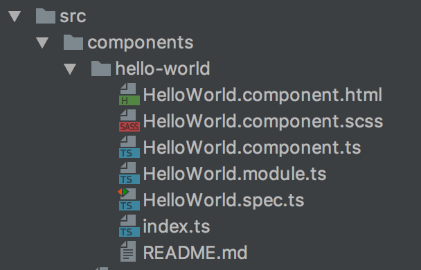

In the [first](http://www.dzurico.com/angular-aot-webpack-lazy-loading/) post we built our application in AOT mode, now it's time to create a library that is AOT compliant.

Most of you are thinking ..."wait, is it not the same????" No it's not, unfortunately it is not an easy job to find good resources and [angular.io](http://www.angular.io) doesn't help a lot for that.

Don't worry we'll figure out how to do it. First things first, of course, we need to write our code... we’ll assume that we have an awesome library containing a component that displays 'HelloWorld' (it will be an useful library :) ).

\[caption id="attachment_7018" align="aligncenter" width="229"\] HelloWorld library\[/caption\]

Nothing special here, in our library we have:

1. module - _HelloWorld.module.ts;_
2. component - _HelloWorld.component.ts;_
3. html - _HelloWorld.component.html_;
4. scss - _HelloWorld.component.scss_  (that will be hard to manage...but we'll see later);
5. test - _HelloWorld.spec.ts_ ... writing the **tests for your library is really important (vital)!!!**

There's one file that requires more attention and it is the module.

\[gist id="1dbb39433d4d22483c524d18dc458b27"\]

The most important lines are **14** and **15**.

By convention, the **_forRoot_** static method both provides and configures services at the same time. It takes a service configuration object and returns a ModuleWithProviders which is a simple object with two properties:

- `ngModule` - the `CoreModule` class
- `providers` - the configured providers

The root `AppModule` imports the `CoreModule` and adds the `providers` to the `AppModule` providers.

Ok! We've our awesome component, now let's build our library by creating the dist that will be used by another application. Unfortunately tools like webpack or rollup are not very helpful for that because they create one output bundled file (and it is not what we want).

In this case we've just one solution and actually it is the best one: the **ngc** compiler. The command is quite easy to use and it's:

**ngc -p src/tsconfig.aot.json**

The tsconfig file is:

\[gist id= "6b48d403db7d6b0902c4de52acc5e073"\]

Of course it is better to write this command in our _package.json_:

\[gist id ="96353c03cd29d68101bea94e14840c64"\]

As you can see on line 11 with the _build_ command we run 3 commands in sequence:

The first one deletes the dist folder, the second one compiles our source code and the last one is the tricky part. Ngc is unable to understand *scss* file so we have to manage it manually. We'll create a gulp file:

\[gist id ="603882bc04eb2397eedb99b94854d950"\]

this gulp performs a couple of tasks:

1. copy all the html files;
2. copy the assets;
3. copy the scss.

The most important part is line **23** that does the inline resource (from Angular Material2 repo):

\[gist id ="a3df2069560447b0db70b188922a16ef"\]

the output of the compiled component will be:

\[caption id="attachment_7019" align="aligncenter" width="422"\] aot compiled component\[/caption\]

As you can see the templateUrl and the StyleUrls have been replaced by their content.

Well, we're done and the full example is available [here](https://github.com/daniele-zurico/angular2-library)! Technically there's a small caveat, the old deploy system like System.js etc requires an *umd* file. We can bundle our library in two possible ways:

1. with webpack (have a look at my previous [post](http://www.dzurico.com/angular-aot-webpack-lazy-loading/));
2. with rollup.js - Larkin suggests to use rollup.js for libraries.

\[caption id="attachment_7042" align="aligncenter" width="465"\] rollup for library\[/caption\]

The last little thing ( I promise it is the last one) is that in the github repo we have _webpack_ for the tests (again ... keep in mind, tests are crucial).

Now we're really done :)

Special thanks as usual to **Olivier Combe** for the review and If you enjoyed the post follow me on twitter [@DZurico](https://twitter.com/dzurico)
