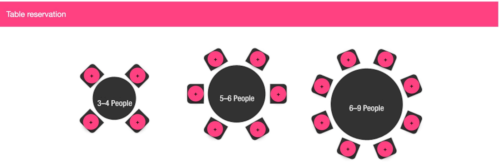
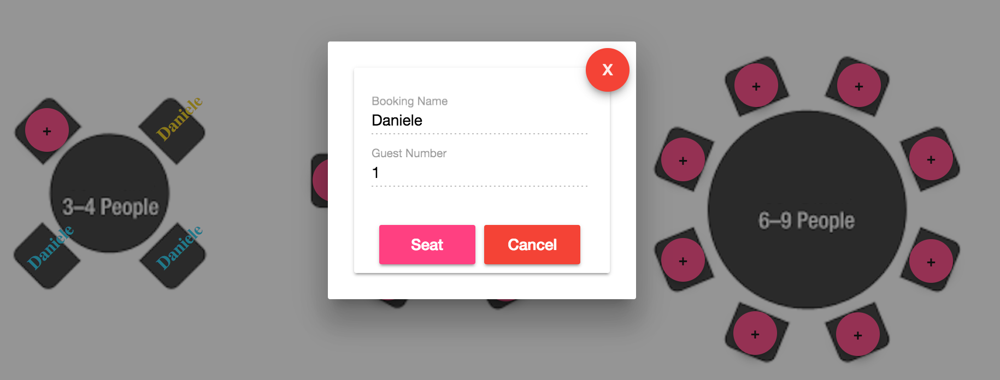
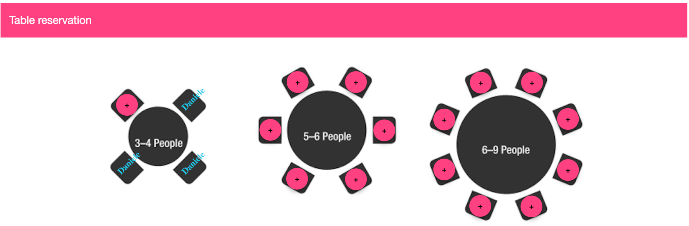
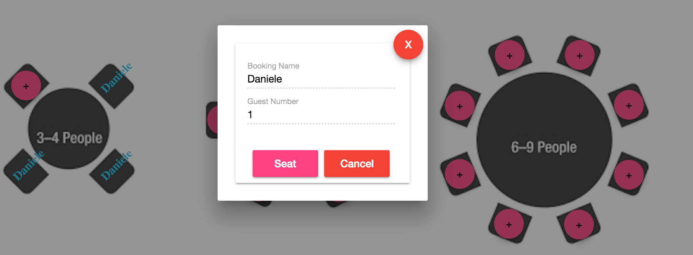

I've heard people talk about ngrx/store and Redux for the past 2 months but honestly I was always busy and I didn't have time to experiment it.

Finally yesterday I decided to take a look at it and well… I can say that I’m really impressed and I don't think that I'll write applications without it.

For the people that are not familiar with Redux, Redux is a predictable state container for Javascript apps. It helps to write applications that behave consistently, run in different environments (client, server, and native) and are easy to test. On top of that, it provides a great developer experience, such as live code editing combined with a time traveling debugger.

It's called redux because it deals with the concept of reducers:

\[gist id="1a8e831f607dc6b01917f988431a8fea"\]

**@ngrx/store** builds on the concepts made popular by Redux and supercharges it with the backing of RxJS. Each application built around store will contain three main pieces:

- Reducers
- Actions
- Store

The **store** records all the information of the application. The store itself is an observable that we can access with operators like map, filter, reduce, etc.. . It promotes the idea of one-way data flow and explicitly dispatched actions. The only way to initiate a state update in your application is through dispatched actions, corresponding to a particular reducer case.

The **reducer** is a pure function accepting two arguments.

1. the previous state
2. an action with a type and optional data (payload) associated with the event

The **action** allows us to communicate to our reducers when state needs to be updated.

Let's do an easy example to better understand how it works. We have a restaurant with 3 tables where the first one has 4 seats, the second one 6 and the third one 8 (small restaurant but it works really well :) ) :

\[caption id="attachment_7057" align="aligncenter" width="1024"\] ngrx/store table\[/caption\]

The customers can book a table:

\[caption id="attachment_7058" align="aligncenter" width="1024"\] ngrx/store book table\[/caption\]

\[caption id="attachment_7059" align="aligncenter" width="1024"\] ngrx/store table booked\[/caption\]

they can cancel the reservation or be seated when they arrive at the restaurant.

\[caption id="attachment_7060" align="aligncenter" width="1024"\] ngrx/store table seat\[/caption\]

The live example is available here ([http://www.dzurico.com/book-table/index.html](http://www.dzurico.com/book-table/index.html)) and the source code here: [https://github.com/daniele-zurico/table-order](https://github.com/daniele-zurico/table-order) ( I pushed 2 branches: master with the orginal code and feature/ngrx-store using @ngrx-store)

The app.module.ts initialise the **StoreModule** passing the reducer (line 23 to 26):

\[gist id="2051968323a1ba0a85c7bc9731543662"\]

The **PersonListComponent** is the main component of the application:

\[gist id="e02313b02e02a226d472a88c28b4029d"\]

As you can see it is really short, however there're 2 sections really important:

- Line 39-45: we dispatch the actions  passing **result.action** (BOOK, SEAT and CANCEL - passed from the dialog component) and a payload that contains all the data that we need: booking name, number of guests, table id and number of seats.
- Line 23-26: we subscribe on all the changes of the table store and we pass the data to our local variable "people" (used to populate the view).

The last piece of our application is the reducer:

\[gist id="296d3fed520be7020db372c1260706bc"\]

- Line 6-37: we initialise the 3 tables and we pass the value to line 39 (Initial state)
- Line 39-87: based on the action dispatched we book the table, we seat the guests or we cancel the reservation.

Of course this post doesn’t show all the features of this amazing library but if you want to become a master have a look on the official [documentation](https://github.com/ngrx/store).

If you enjoyed this post follow me on twitter [@Dzurico](https://twitter.com/dzurico)!
