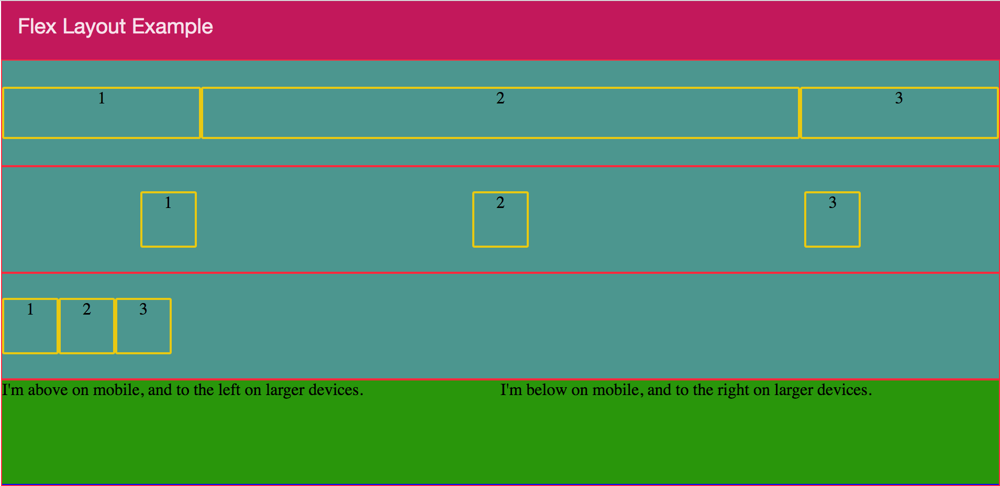

I'm a big fan of Angular Material2 and I have been using it from the alpha version. Unfortunately Material2 didn't have any flex layout system so you needed to use an external one.

When Material2 *beta1* was released they updated the [readme.md](https://github.com/angular/flex-layout/blob/master/README.md) file with amazing news:

layout

see [angular/flex-layout](https://github.com/angular/flex-layout)

\-

\-

this library is still in beta1 but according to my experience it looks stable and ready to use and you don't need Angular Material2 or any other frameworks to use it.

Angular Flex Layout provides a sophisticated layout API using FlexBox CSS + mediaQuery.

This module provides Angular (v2.x and higher) developers with component layout features using a custom Layout API, mediaQuery observables, and injected DOM flexbox-2016 css stylings.

The Flex Layout engine intelligently automates the process of applying appropriate Flexbox CSS to browser view hierarchies. This automation also addresses many of the complexities and workarounds encountered with the traditional, manual, CSS-only application of box CSS.

To install it run:

_npm install @angular/flex-layout -save_

And then import the _FlexLayoutModule_:

\[gist id="f1240ae9a70f7547df1f3ba78e5d7836"\]

The public **Layout API** is a simple list of HTML attributes that can be used on HTML containers and elements.

API for DOM containers:

HTML API

Allowed values

fxLayout

`row | column | row-reverse | column-reverse`

fxLayoutAlign

` start|center|end|space-around|space-between``start|center|end|stretch `

fxLayoutWrap

`"" | wrap | none | nowrap | reverse`

fxLayoutGap

%, px, vw, vh

API for DOM elements:

fxFlex

"" , px , %, vw, vh, " ",

fxFlexOrder

int

fxFlexOffset

%, px, vw, vh

fxFlexAlign

`start|baseline|center|end`

fxFlexFill

API for any element:

HTML API

Allowed values

fxHide

TRUE, FALSE, 0, ""

fxShow

TRUE, FALSE, 0, ""

Breakpoint aliases:

breakpoint

mediaQuery

""

'screen'

xs

'screen and (max-width: 599px)'

gt-xs

'screen and (min-width: 600px)'

sm

'screen and (min-width: 600px) and (max-width: 959px)'

gt-sm

'screen and (min-width: 960px)'

md

'screen and (min-width: 960px) and (max-width: 1279px)'

gt-md

'screen and (min-width: 1280px)'

lg

'screen and (min-width: 1280px) and (max-width: 1919px)'

gt-lg

'screen and (min-width: 1920px)'

xl

'screen and (min-width: 1920px)'

Now that we know all the directives let’s try to use them.

\[caption id="attachment_7090" align="aligncenter" width="1024"\] Flex layout example\[/caption\]

\[gist id="ea46e63637354384e72784a461a1e8a6"\]

Let's explain each section:

- On the first row (line 6 to 10) I set the first block on 20% width, the second 60% and the third fill the remain space.
- On the second row (line 13 to 17) the horizontal alignment is space-around and vertically is center.
- On the third one (line 20 to 24) the horizontal alignment is begin and vertically is center.
- On the forth one (line 27 to 33) the two block are horizontally aligned by default and for smaller devices (xs and sm) are vertically aligned.

Of course this post doesn’t show all the features of this amazing library but if you want to become a master have a look at the official [documentation](https://github.com/angular/flex-layout).

If you enjoyed this post follow me on twitter [@Dzurico](https://twitter.com/dzurico)!
