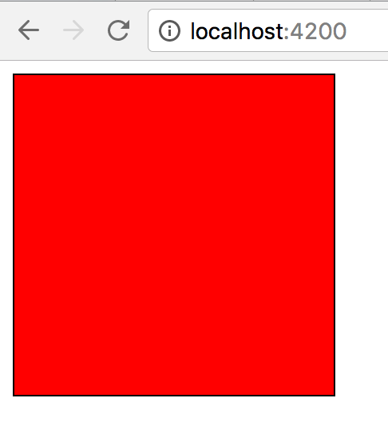
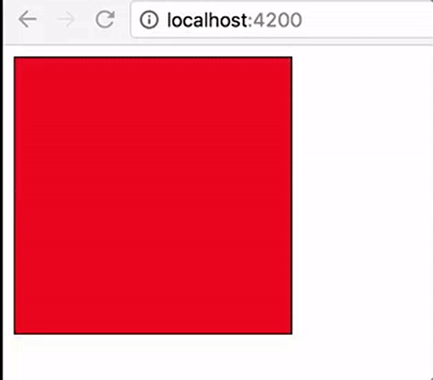
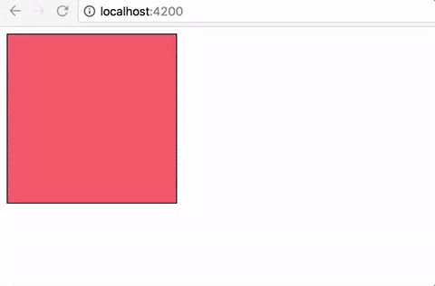

Well-designed animations can make a UI not only more fun but also easier to use.

Angular's animation system lets you build animations that run with the same kind of native performance found in pure CSS animations. You can also tightly integrate your animation logic with the rest of your application code, for ease of control.

Let’s do an easy example to better understand how it works. We'll create a square of 200x200 with a black border of 1px and step by step we'll try to animate it.

\[gist id="ed1c99f671a5ebce575524d7e2cb462a"\]

Now that we've our square let's try to change the background color using _animations._

\[gist id="1f9c941875b219cf4c59d7d507a4a2d2"\]

- we imported  (line 1) from @angular/core all the dependencies that we need: "trigger, state, style"
- we declared a new property called *@animateState _and we assigned a static value: _active* (line 5)
- we added the *animations* attribute to our component and we said that when the value of animateState is active we set the background colour to red and when is inactive it will be yellow (line 6-16) . We still haven't set the value of animateState to inactive so do not wait until it will change...it will never happen :)

\[caption id="attachment_7117" align="aligncenter" width="215"\] initial state of animation\[/caption\]

Everything looks fine however is much better if we have assigned a variable to *animateState. *

\[gist id="89bcbdf19a6508ea7b4405d3824ff262"\]

- we created a variable called _state_ (line 19)
- we used it in the template (line 5)

It's time! you excited? I honestly was.. I never expected that I was able to do an animation with so less code.

\[gist id="11739ee2baa2678c4bd5ce84329e324e"\]

The only things that we did here are:

- Define a transition from whatever state (\*) to whatever state (\*) and animate for 2s (line 15)
- Change the value of \_state _in \_inactive _after 2 sec (line 23-26)

\[caption id="attachment_7120" align="aligncenter" width="265"\] animate state\[/caption\]

I agree with you, we built an easy animation but trust me is not complicated to create a complex one.

For example if we want to change the colour and the size of the square at the same time:

\[gist id="e3e2d6b869ed6f9f776781eeaa18f482"\]

the only change that we made are lines 11-12 with the original width and height and lines 16-17 width the final size.

\[caption id="attachment_7122" align="aligncenter" width="413"\] minimise and change colour\[/caption\]

For a list of all the possible animations that you want to apply, visit the [W3C animations page](https://w3c.github.io/web-animations/) and if you think that you need to implement complicated easing animation have a look on [easing.net](http://easings.net/).

We just scratched the surface, for more information have a look on the official [documentation](https://angular.io/docs/ts/latest/guide/animations.html)! Angular animate allow us to implement really complicate animation. Matias Niemelä at NgEurope did an amazing talk that I really suggest:

https://www.youtube.com/watch?v=NGNE7LMd9VY&feature=youtu.be

If you want to animate your routes have a look on this [repro](https://github.com/matsko/ng2eu-2016-code/blob/master/route_animations.ts)

If you enjoyed this post follow me on twitter [@Dzurico](https://twitter.com/dzurico)!
