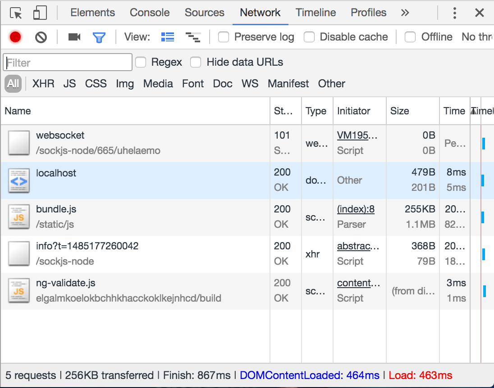
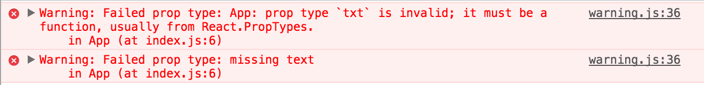
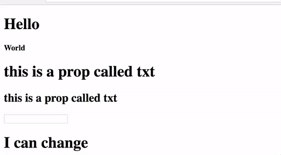

I used angular from almost 5 years (1.x and 2.x) but I never tried React and I want to see how it works and I want to have my own idea on which one is better or maybe when I should use one of them.

Most of the things that I'm going to describe in this post are well know for the people that already use ReactJs however if you don't know it (like me) you should spend same time to have a look on it to see if it is something that you should try as well or not.

As angular has [angular-cli](https://cli.angular.io/) also react has a scaffolder to create React apps with no build configuration: [create-react-app](https://github.com/facebookincubator/create-react-app).

Similar to angular-cli we need to install it globally:

npm install -g create-react-app

Generate our application:

create-react-app my-app

Use it:

npm start

It's really easy to use and, as angular-cli, it has a lot of utilities and commands to upgrade, run the tests, adding custom environments however it has no support for preprocessors such as Less and it use es6.

I'm a bit disappointed to do not use scss and my lovely typescript, I'm pretty sure that if I look on google I can do it, but I'm still a react baby and I don't want to start to go crazy with configurations (I'll probably do later or same nice guys will left a comment here helping me to do it).

Ok let's go ahead and see the result of my first react application.

Omg it's awesome, it's super tiny, fast and it doesn't need any AOT compilation (look my previous post on [Angular AOT compilation](http://www.dzurico.com/angular-aot-webpack-lazy-loading/)), **256Kb and load in 463 ms**:

\[caption id="attachment_7139" align="aligncenter" width="386"\] first react app\[/caption\]

I'm quite skeptical maybe if I need things more complex it will be super complicated to implements but for now it is faster and smaller so let's go ahead and have a look at the code.

Let's remove all the unused file from the starter and just leave three of them:

- public/index.html
- src/App.js
- src/index.js

We'll not touch the index.html however we will rewrite from scratch the app and the index.

The first thing that we need to learn is how to create a component:

\[gist id="28ffa2e35d7d2925ef7e54cd722d1ece"\]

html inside js (it's called jsx)? I've always used to split html from js and it looks very strange! Ok let's continue and see how we can pass parameters inside to our component.

In the index.js the only thing that we've to do is pass a new attribute:

<App txt="this is a prop called txt"/>

and in the App.js:

\[gist id="f49b5d194547f6ec080299339e8d8646"\]

I used different ways:

- declare a variable and use it (line 3 and line 9);
- use it directly (line 8);

No main differences here apart that in no place is written that our component accept an attribute that is a string and is required.

Looking on the documentation I realised that we can do it:

\[gist id="8bc6d8ec42e0b941e944f8f18ff3a865"\]

but it's not easier in angular?

@Input() txt: string = "this is the default props";

Maybe is not exactly like that because it does something more powerfull with less code:

\[gist id="ef63746944e2f46f864a08bda543f9a0"\]

Here we said that _txt_ is not only a string but is also required. We can also define our custom validations:

\[gist id="76e0954c5a05be772a64e5f5ef3e0db2"\]

where if we don't pass the txt prop in the index.js we'll receive 2 errors:

\[caption id="attachment_7145" align="aligncenter" width="478"\] error missing props\[/caption\]

React manage in different way properties and state, we saw already the properties but what I didn't understood was that the properties can't be changed by the component. If we want to change something we need to use _state_:

\[gist id="ecb5914b516055ca2a818676f5dc01b0"\]

If we type something in the input we'll see that our stt variable will change the value.

\[caption id="attachment_7143" align="aligncenter" width="480"\] change state\[/caption\]

Another way to write a component is using the stateless function:

\[gist id="3e7986974f7c17265333f77488880ea5"\]

On line 40 you can see that we created another input and we pass prop. the main difference with the class is that the function is stateless.

The other thing that I was thinking is ok we pass properties from parent to child but what about communication? How I can communicate between components....then I remember **redux** used of course also in angular with different implementations like [@ngrx/store](http://www.dzurico.com/ngrx-store/)!!!!

Everything make sense now and I have to be honest react is really easy to understand if you have a base knowledge of components, parameters, events or if you coming from the angular world.

It Is quite hard for me moving from Angular to React because I love it but for all the people that are struggling to understand which one they have to use my suggestion is to test both and choose the best one keeping in mind that react is a library Angular is a framework.

If you enjoyed this post follow me on twitter [@Dzurico](https://twitter.com/dzurico)!
