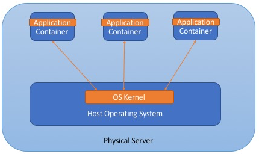
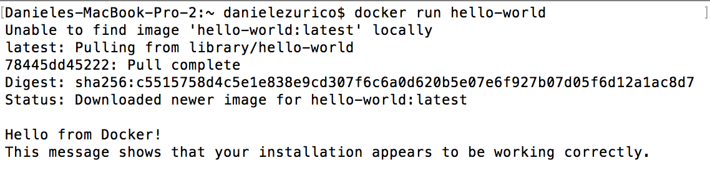
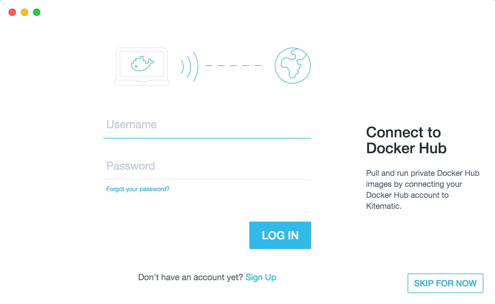
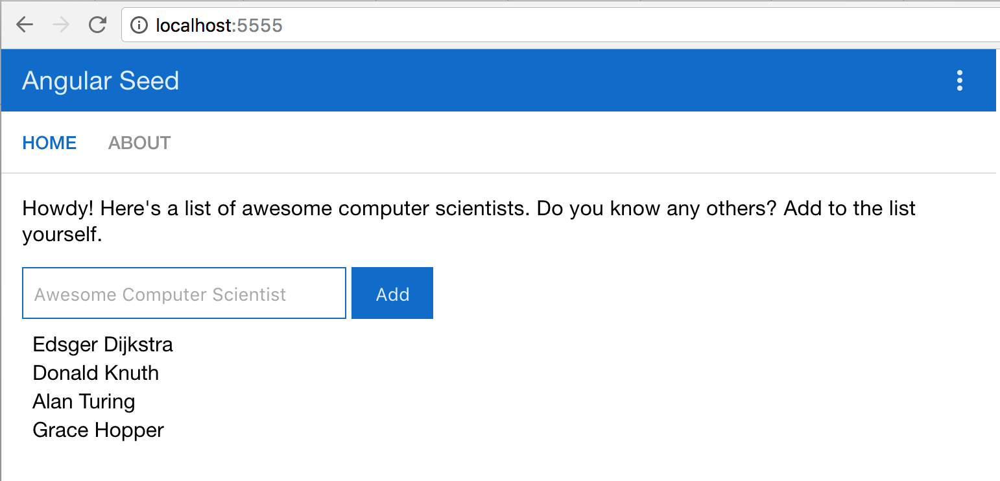
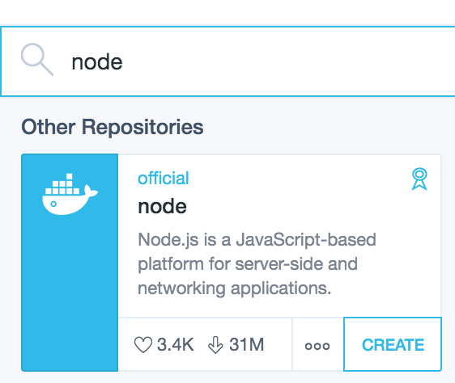
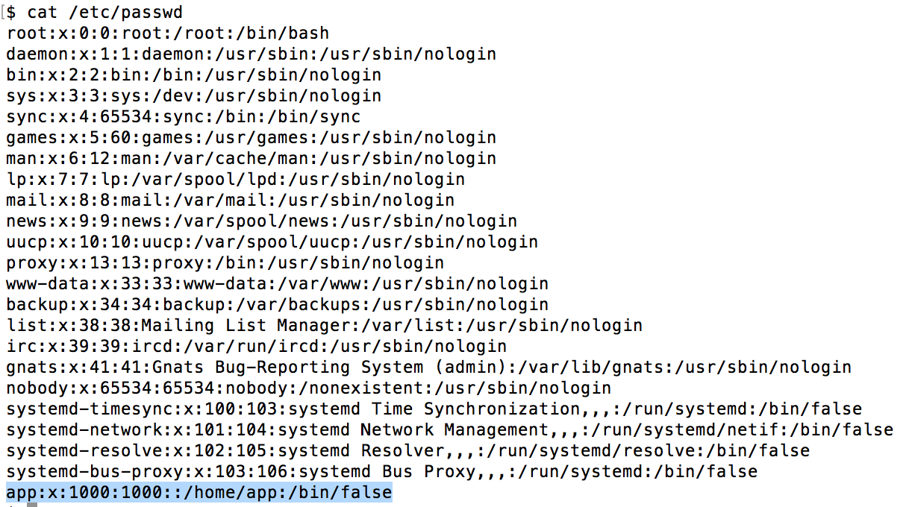
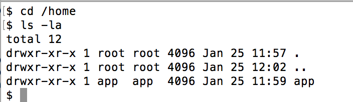
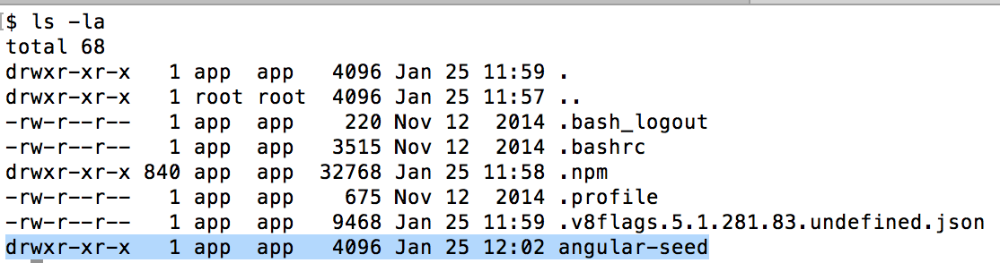

**@Update**: this post has been added to [angular-seed wiki](https://github.com/mgechev/angular-seed/wiki)

Docker is a platform for developing, shipping and running applications using container virtualization technology.

In the past to deploy your application you needed to buy a physical server and that one has a lot of problems like: huge costs, waste resources, difficult to scale, hard to migrate.

To solve this problem we can have a physical server that contain multiple applications and each application run in a virtual machine however each application has his own operating system and allocated resources (ram, Storage, CPU, etc).

This introduce us to the concept of Containers where a container based virtualization uses the kernel on the host’s operating system to run multiple guest instances and each container has its own Root filesystem, processes, memory, etc.

\[caption id="attachment_7157" align="aligncenter" width="430"\] docker structure\[/caption\]

Each application can use different third party libraries and they don’t go in conflicts each other (for example three different versions of java).

So the main difference with the VM are:

- They’re more lightweight
- No need to install guest OS
- Less CPU, RAM, storage space required
- More containers per machine
- Great portability

Now that we appreciated the power of docker let’s jump in same details. First of all we need a **docker engine,** it’s a program that enables containers to be built, shipped and run. It uses Linux kernel namespaces and give us the isolated workspace.

To install it just go to the installation [link](https://docs.docker.com/engine/installation/) based on your os and follow the easy installation steps.

To check if everything is working correctly we can run:

docker run hello-world

and what we should see is something like that:

\[caption id="attachment_7158" align="aligncenter" width="382"\] first-install docker\[/caption\]

Now that we’ve our engine up and running the next step is to install [Kitematic](https://kitematic.com/) a CLI client and GUI that we’ll help us to perform most of the operations without have a strong knowledge.

\[caption id="attachment_7159" align="aligncenter" width="393"\] kitematic\[/caption\]

Sign Up to docker Hub and then login.

Here you can search same images already built by the community and check your local containers.

Now that we ready let’s go one step further and let’s talk about docker compose. Compose is a tool for defining and running multi-container Docker applications. With Compose, you use a Compose file to configure your application’s services. Then, using a single command, you create and start all the services from your configuration. It is great for development, testing, and staging environments, as well as CI workflows.

Using Compose is basically a three-step process:

1. Define your app’s environment with a Dockerfile so it can be reproduced anywhere.
2. Define the services that make up your app in docker-compose.yml so they can be run together in an isolated environment.
3. Lastly, run docker-compose up and Compose will start and run your entire app.

Now that we’ve a good overview of all the piece that we need we can start to experiment something.

A repro that I find really good is [Angular-seed](https://github.com/mgechev/angular-seed) from mgechev in this case we’re not really interested about all the configuration that Minko did but we’re interested on the docker part.

When you downloaded the repo enter inside the folder and run:

docker-compose build

docker-compose up –d

Now open your browser at [http://localhost:5555](http://localhost:5555) and you should be able to see the final result:

\[caption id="attachment_7160" align="aligncenter" width="424"\] angular-seed\[/caption\]

Now that we see that everything works correctly let’s have a look on the files that Minko created for us.

Let’s start from docker-compose.yml:

\[gist id=”95fec1078b95a1a5833adcb9dc5ddc3a”\]

Line 5 - A service definition contains configuration which will be applied to each container started for that service, much like passing command-line parameters to docker run. Likewise, network and volume definitions are analogous to docker network create and docker volume create.

Line 7 – define the context of the application and “.” means to look in the same directory

Line 12 – define how the network will be (bridge)

Have a look on the file angular-seed.development.dockerfile specified at line 8.

\[gist id=” a90c38ee2355000ecd1b2ff699c839cd”\]

Line 1 – specify the image available on the cloud using the version 6.6:

\[caption id="attachment_7161" align="aligncenter" width="346"\] node-cloud\[/caption\]

create the user app (line 4) set the environment for home (line 6)and for the app_name (line 9) and when everything is ready run npm install (line 19)

\[caption id="attachment_7162" align="aligncenter" width="450"\] check-app\[/caption\]

\[caption id="attachment_7163" align="aligncenter" width="458"\] app home\[/caption\]

\[caption id="attachment_7164" align="aligncenter" width="454"\] angular-seed in home directory\[/caption\]

when it finish finally it run command: npm start ( line 9 on docker-compose.yml)

If you want to experiment more and see how production works run these commands:

\[gist id=” 3f6d75b4384e697624ca375a24092601”\]

and see how docker-compose.production.yml is done

The last couple of things that I want to point is that:

- you can create a .dockerignore exactly like a .gitIgnore
- you can setup a continuous integration with your bitbucket or github account ([https://docs.docker.com/docker-cloud/builds/link-source/)](https://docs.docker.com/docker-cloud/builds/link-source/))
- setup slack integration ([https://docs.docker.com/docker-cloud/slack-integration/)](https://docs.docker.com/docker-cloud/slack-integration/))

If you enjoyed this post follow me on twitter [@Dzurico](https://twitter.com/dzurico)!

**Resources**

- https://docs.docker.com/
- https://github.com/mgechev/angular-seed
