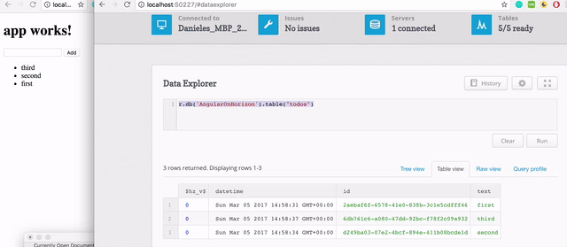
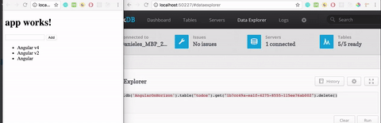
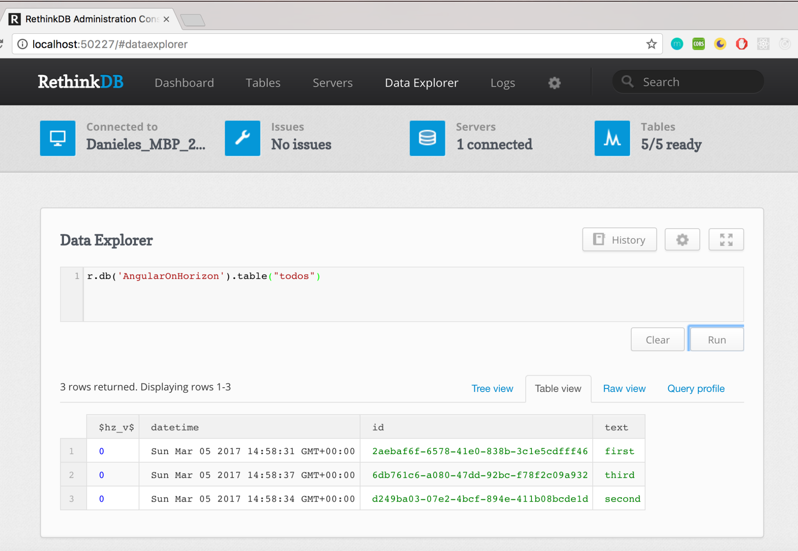

I've always been fascinated by realtime data but at the same time scared about the quantity of code that you need to write to achieve that result:

- Front-end
- Back-end
- Socket
- Database

One of the best solutions to have realtime applications is  [Firebase](https://firebase.google.com), it does really a lot and for hobbyists it is free as well. However every time that I had a chat with other companies they were sceptical because you need to host data ( that generally are not of the company but of the client) on the cloud and it is really hard sometimes to convince the client to do that.

Few days ago I posted the question on twitter and Wassim ([@manekinekko](https://twitter.com/manekinekko)) replied with another magical name: **Horizon**.

Maybe you're a bit confused on what I'm talking about so have a look at this gif to understand exactly on what I'm referring to:

\[caption id="attachment_7210" align="aligncenter" width="640"\] live_demo\[/caption\]

On the left side the angular application and on the right one the dbadmin where 3 queries have been executed to delete the fields on the data. As you can see, the angular application **reflects the changes** **without refreshing the browser**! It's magic right? It's like a dream.

Now the most sceptical will say:"oh yes how much code did you write to achieve this result?"

And here the best reply: Almost nothing!

I installed Horizon, I created a service and I saw the application up and running! Although I'm a newbie with that tool  and I spent 10 mins to setup everything.

Let's have a look now at the step that I performed:

\[gist id="https://gist.github.com/daniele-zurico/b31cf25518b922ad82f8b45c149e2d87"\]

Let's  create the service to connect to our db. In our project folder you need to run:

**ng g service horizon**

Angular cli will generate  a new service called horizon.service.ts (and the test as well).

Open with your editor the service and replace the content with that:

\[gist id="37f14f295e3e24d422fae4cd91ffa032"\]

Inport your service in the module ( app.module.ts):

\[gist id="8acffe27f5647a7fa0468f522978f8b1"\]

And finally in your component (app.component.ts):

\[gist id="5d0b646cb28ae2f0464e92c937f4ca97"\]

Now it's time to run horizon and angular:

\[gist id="43088ea5b6c3d7974b649e5b456fe4bd"\]

\[caption id="attachment_7199" align="aligncenter" width="480"\] angular-app\[/caption\]

(I refreshed the browser to show that it's not mock data :) )

And opening the horizon interface we can see:

\[caption id="attachment_7200" align="aligncenter" width="1024"\] rethinkdb\[/caption\]

The complete source code is available on my personal github (https://github.com/daniele-zurico/angular-horizon):

If you enjoyed this post follow me on twitter [@Dzurico](https://twitter.com/dzurico)

Resources:

- https://cli.angular.io/
- http://horizon.io/docs/getting-started/
- https://rethinkdb.com
- https://github.com/otodockal/angular-on-horizon
