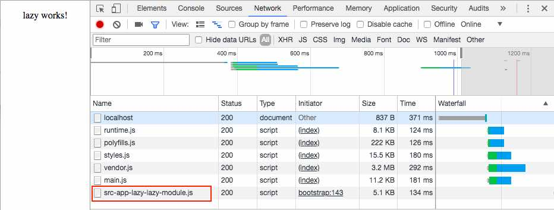

In my previous company we created a project that was built with widgets. A page was just a container with placeholder and in each placeholder there was a configurable widget that could be added or removed based on a json config file. The main challenge was to load these widgets lazily and it was quite hard because cli was not able to do that by default so we end-up hacking the code a little bit creating the same approach of the routing.(https://angular.io/guide/lazy-loading-ngmodules)

Finally with the new version of cli we can achieve it without too much effort and quite easily.

As usual the first thing is to setup a new project with angular-cli (make sure that you have 6.0.1 installed):

`ng new lazyApp`

When your project is up and running we need to create a new module and then a new component:

`ng g module lazy ng g component lazy`

We need to apply some changes on the module and implement the loading in the component. We start lazy.module.ts and we need to apply these small changes:

\[gist id="3a015f6485994b45e5cdef63be163408"\]

We defined which one is our entryComponents and a static variable called \`entry\`.

Now that our module is ready we need to load it dynamically and lazy loading the resource on demand.

Open app.component.ts and copy that:

\[gist id="3e35f14784b65aafe7853d6e8df4f2f9"\]

Nothing new I can say. We created a viewChild called testOutlet and we load the module and the component.

We need to make the last change on the code to define the \`testOutlet\` in our template. Open the app.component.html remove all the content and paste the follow code:

\[gist id="b4ee0bb2cfe6c9f08508fe32b3f9f4a6"\]

We almost done it's just missing the magic part: the cli configuration!

Open angular.json and in the build section paste the following:

\[gist id="56214a92e5c57ec9fe56a46b0d5a129e"\]

Now we can see the result running as usual:

**ng serve**

And we'll see our lazy loaded module:

\[caption id="attachment_7250" align="aligncenter" width="776"\] lazy-module\[/caption\]

In case of problem I just created a [repro](https://github.com/daniele-zurico/lazy-load-cli) in my github! Feel free to download it!

If you enjoyed this post follow me on twitter [@Dzurico](https://twitter.com/DZurico)
