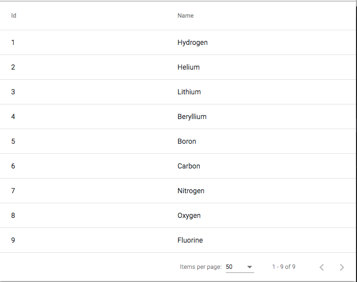

One of my first [post](http://www.dzurico.com/how-to-create-an-angular-library/) was about creating a library for angular (note the feature image that shows a most recent library :) ) . It was quite tricky as you had to create a couple of script to make everything working correctly.

With the new @angular/cli this task is now really easy to accomplish so let's exercise by creating our first and maybe useful library.

What we want to achieve is something like that:


Maybe you got scared and maybe you are thinking that you'll need to write a lot of code but bear with me and you'll see that everything will be ready in few steps.

Remember to install the latest (6.0.3) version of [angular/cli](https://github.com/angular/angular-cli/wiki/1-x-stories-1.0-update) and when you ready we can generate our new project:

```
ng new data-table
```

Enter into the cli project and  create our library called ngx-data-table:

```
cd data-table/
ng generate library ngx-data-table

```

This command will generate for us a new folder:

\[caption id="attachment_7253" align="aligncenter" width="351"\] library\[/caption\]

and it will update our angular.json, package.json and tsconfig.json.

We don't really need to worry about what @angular/cli did for us but it is good to know that under the wood it's using [ng-packagr](https://github.com/dherges/ng-packagr) as you can notice opening the package.json. Technically our library is done and ready to be shipped so if you're not interested to create the data-table you can run:

```
npm run build ngx-data-table --prod
```

and in the _dist_ folder we'll find our bundle ready to use or maybe publish on npm:

\[caption id="attachment_7254" align="aligncenter" width="308"\] bundle\[/caption\]

I really suggest  to continue reading this post and you'll see that in few steps and writing some code we'll have our data-table ready to use. We can remove all the files inside the lib folder and create ours. So:

```
rm -rf projects/ngx-data-table/src/lib/*
```

enter inside the lib folder:

```
cd projects/ngx-data-table/src/lib/
```

and run the following command:

```
ng g module ngx-data-table
```

this will generate our fresh new module.

If you still with me let's try to use some other schematics of _@angular/cli_.

```
ng add @angular/material --project=data-table
```

This command will preconfigure our environment  for _@angular/material_ making changes on our _package.json_ and angular.json. By default it uses the _indigo-pink theme_ but if you prefer another one instead,  feel free to change in the _angular.json_ file in the style object.

Drumroll....let's generate the material table:

```
ng generate @angular/material:material-table --project=ngx-data-table --name=ngx-data-table
```

This is my favourite one!!!. We generated a material table without writing any code; we just need to export the component (line 14):

\[gist id="9bf51c82548d27a80c7a0ff568aa45dd"\]

Include the library just created inside the app.component (ts and html) under _src/app (line 15)_:

\[gist id="d621ae84d56e664ed939ccd465087a71"\]

\[gist id="88e7ad3b97f619b91c3bc49df2b1cb4c"\]

run:

```
ng serve
```

and surpriseeee:

\[caption id="attachment_7261" align="aligncenter" width="708"\] library data-table\[/caption\]

Our data-table library with :

- sorting
- paginating
- item per page

Is done!

Some of you will complain saying:"yes buuuut..... the data are static and a library with static data is not a library!" Ok ok let's apply also these changes and finish it ;)

Open the _ngx-data-table.component.ts_ under lib/ngx-data-table and apply these changes:

\[gist id="c38f0c9f56ba53e4753d2c84737da101"\]

What we doing here it's passing an input called _data,_ create the datasource and the _displaycolumns_ from the the first object in the array.

The _ngx-data-table-datasource.ts_ doesn't need anymore the static data and need some small changes to take the values dynamically:

\[gist id="825b1304ca66bfa54dfa22b1f59cc553"\]

If you compare with the original one I didn't change a lot, I've just added an extra parameter in the constructor to take the source and modified the getSortedData to be dynamic.

Finally we can change also the template:

\[gist id="09288f8841b47ef3e73ec184656e3273"\]

that can loop with an ngFor.

We done with the library the only thing that we need to do it's to pass same mock data from the app and see if it works.

Open app.component.ts under src/app and add some mock data as follow (feel free to change the name of the columns or remove one):

\[gist id="7af61304ac186b9155bafb01576de614"\]

and in the app.component.html we pass them:

`<ngx-data-table [data]="data"></ngx-data-table>`

Now if we did everything correctly the result should be that one:

\[caption id="attachment_7262" align="aligncenter" width="1082"\] library data-table used in the project\[/caption\]

I truncate some data just to show the footer as well :)

If something is not working as expected I published everything on this [repro.](https://github.com/daniele-zurico/library-ngx-data-table)

## **@Bonus - How do we publish a library on npmjs.org?**

First thing that we need to do is register on [npmjs](https://www.npmjs.com/signup).

After that we can move inside the folder of our library:

```
cd /library-ngx-data-table/projects/ngx-data-table
```

Now we can setup our NPM author info:

```

npm set init.author.name "Your Name"
npm set init.author.email "you@example.com"
npm set init.author.url "http://yourblog.com"
npm adduser
```

We can initialise our package.json (adding some informations like author, repo, website etc):

```
npm init
npm install -g pakmanager

```

After that we can move on our dist folder that we generated before(`npm run build ngx-data-table --prod`) and run:

```
npm publish ./
```

\*\*

### Stay tuned for the second part of this post and we'll improve our data-table ;)

\*\*

Thanks [@robwormald](https://twitter.com/robwormald) and @ocombe for the review... really appreciated!

If you enjoyed this post follow me on twitter [@Dzurico](https://twitter.com/DZurico)
