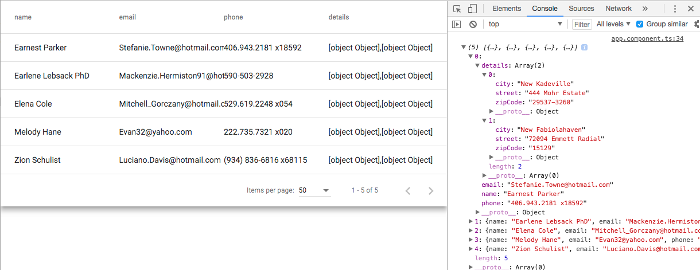
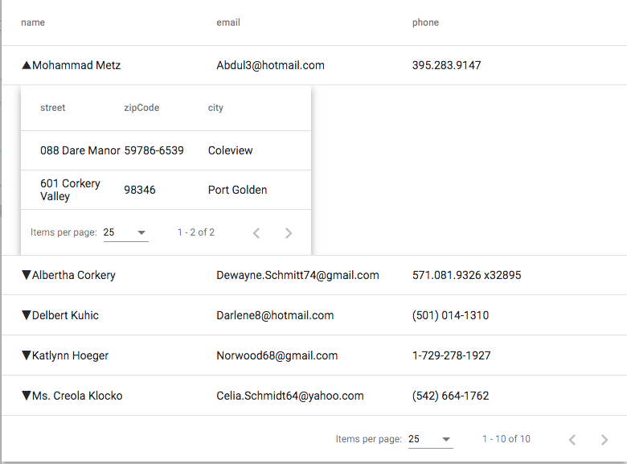
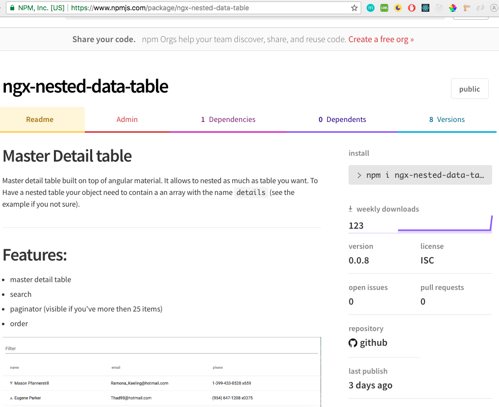

In the previous [post](http://www.dzurico.com/generate-a-data-table-library-with-angular-6/) we built a material data table, we have packaged as a library and we have learnt how to publish on npm.

Today we want to improve it by adding the two functionalities displayed in the featured image above. To make it so, we need to made some adjustments:

1. Expand the column when the object contains another object that we decided to be called "_details"_;
2. use the "_when_" functionality provided by material;
3. create a caret where we can click;
4. add some cool animation;
5. Bonus: add a search functionality;
6. use the library.

Let's define some mock data where we can work on. I'm quite lazy and without fantasy so looking around I found out an amazing package called [faker.js](https://github.com/marak/Faker.js/) that generate massive amounts of fake data in Node.js and the browser:

```
npm install faker --save-dev
```

When the installation is completed we can move in our "_src/app.component.ts_" file and generate them as follow:

\[gist id="087f38a5ab04bf43565cef1632afc8a0"\]

If we run _ng serve_ we can see something like that:

\[caption id="attachment_7309" align="aligncenter" width="1024"\] first result\[/caption\]

Our table doesn't look so right. It contains a column called "_details_" that should disappear and it doesn't contains our sub-table but at least we have all the information we need.

Let's open our library project:

```
cd projects/ngx-data-table/src/lib/ngx-data-table
```

And make all the changes step by step.

\- Filter the column details:

In the

```
ngx-data-table.component.ts
```

we need to apply a small change:

from:

```
this.displayedColumns = Object.keys(_data[0]);
```

to:

```
this.displayedColumns = Object.keys(_data[0]).filter(key => key !== 'details');
```

\- An handler to expand and collapse a row:

```
expandedElement: Array;
toggleRow(row) {
    if (this.expandedElement === row) {
      this.expandedElement = null;
    } else {
      this.expandedElement = row;
    }
  }
```

\- Implement the "when" functionality from [angular/@material](https://material.angular.io/components/table/api):

```
isExpansionDetailRow = (i: number, row: Object) =>
    row.hasOwnProperty('detailRow');
```

\- Add some animation to make everything more cool when we expand/collapse the row:

```
animations: [
    trigger('detailExpand', [
      state(
        'collapsed',
        style({ height: '0px', minHeight: '0', visibility: 'hidden' })
      ),
      state('expanded', style({ height: '*', visibility: 'visible' })),
      transition(
        'expanded <=> collapsed',
        animate('225ms cubic-bezier(0.4, 0.0, 0.2, 1)')
      ),
    ]),
  ]
```

In case you got lost somewhere this is the full source code:

\[gist id="1905eedcdf912240325d3cedf69a9cee"\]

At the moment we can't appreciate the changes we made because we didn't modify our template, so why wasting time...let's do it straight away opening "ngx-data-table.component.html":

\- We change the first cell adding a caret: \[gist id="958951f69f868d4c699aa3c61f3cde44"\]

It will be displayed only if the object contains the _"details"_ property and will flip down/up if the column is expanded/collapsed.

\- we implement the "when" functionality: \[gist id="eb5510cfe579d765c94d3358c9a618e7"\]

\- We implement the recursion. In this case the only thing we need to do is to load the component itself passing the new array from details: \[gist id="e8ee36a56643a3772f81128838df968d"\]

And as usual this is the full html code: \[gist id="785d7524aebd11afcc088c55174877ff"\]

The last change we need to do is the enrichment in our "_ngx-data-table-datasource.ts_" adding a new row (hidden) all the time the object contains "_details_":

```
const rows = [];
    filtered.forEach(
      element =>
        element.details
          ? rows.push(element, {detailRow: true, element})
          : rows.push(element)
    );
    return rows;
```

\[gist id="5ccc9b6198a993a83ee8352f17087195"\]

If we reload now the browser we'll get our result: 

mmm ... maybe we need a bit of css: \[gist id="28ccfa26447ab8e77c74ce3df7ed1c17"\]

Now is much better we got our recursive (n-depth) level master detail table.

## Bonus

At the beginning of the post I was talking about the search functionality however as the post was becoming too long, I decided to publish the project on [github](https://github.com/daniele-zurico/ngx-nested-data-table) and on npmjs.org:

```
https://www.npmjs.com/package/ngx-nested-data-table
```

**Feel free to download/fork or create tickets** on github:

```
https://github.com/daniele-zurico/ngx-nested-data-table
```



Don't ask me how that is possible to have **123 downloads** already because I've no clue!!! :D

## Important and suggestions

I was thinking to add the voice recognition on the search bar ... if you think that it's worth it let me know and I'll do it otherwise enjoy it.

If you enjoyed it please follow me on twitter [@Dzurico](https://twitter.com/DZurico)
