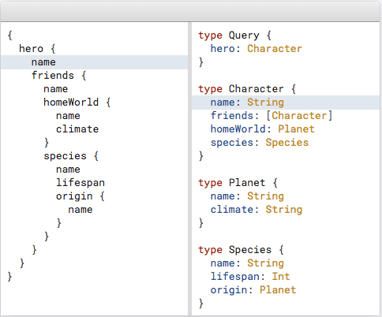
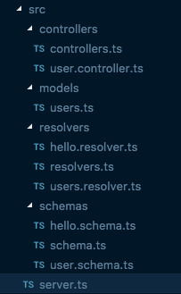
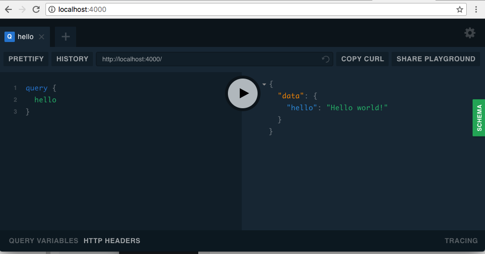

It's almost 2 months that I'm working with GraphQL and after a bit of struggling I fallen in 😍love😍. If you never heard about GraphQL I can tell you that it's strongly used by Facebook and, after beeing open-sourced, it has been adopted by other companies like:

- github/v4
- pinterest
- shopify
- neo4j
- more and more

**So what is exactly GraphQL and why we should invest our time to learn it?**

GraphQL is a query language for APIs and a runtime for fulfilling those queries with your existing data.
GraphQL provides a complete and understandable description of the data in your API, gives clients the power to ask
for exactly what they need and nothing more, makes it easier to evolve APIs over time,
and enables powerful developer tools.

**Sorry?** **Yes this is the same question I had when I read the doc... so let me try to share why I love graphQL.** From my short experience I found it very useful because the client has more power and he can ask the data and the fields in the format that he wants. If we think about REST api, they are built in a very strict way and when the application grows it needs to create a lot of endpoints to accomplish all the possible scenarios. Just to give a quick example: 

After this brief introduction we can start our configuration installing mongo on our machine. For mac users is quite easy with brew but in case you're not familiar this is the [official guide to follow](https://treehouse.github.io/installation-guides/mac/mongo-mac.html). When the installation is completed we can start mongo server and create our database:

```
mongod
```

I use a gui tool called [Studio3T](https://studio3t.com/) to create my db but feel free to use the tool you prefer. The name of our database will be:

```
graphexample
```

Now that we almost understood what is and why we should use it let's built our server. The infrastructure we'll build is:

1. NodeJs with Typescript
2. mongoose
3. express
4. apollographql/apollo-server 2.0

Let's create a folder called _graphql-setup_ and inside it a file called _package.json_ that will look like that: \[gist id="c013d9e434a08a0412933dc6b7118930"\]

As you can see we don't have too many dependencies apart apollo, mongoose (the connector for mongo) and typescript.

In the script section we created dev and prod but we're going to use dev for our tests running the command:

```
npm run dev
```

Due of typescript we need a tsconfig.json and tslint.json to compile the project and set stylistic rules like indentation, whitespace, etc. If you've no idea how to create them you can easily copy paste them:

- tsconfig.json: [https://github.com/daniele-zurico/graphql-setup/blob/graph2/tsconfig.json](https://github.com/daniele-zurico/graphql-setup/blob/graph2/tsconfig.json)
- tslint.json: [https://github.com/daniele-zurico/graphql-setup/blob/graph2/tslint.json](https://github.com/daniele-zurico/graphql-setup/blob/graph2/tslint.json)

We need to create a _src_ folder and under it same sub-folder to organise better our code:

- **schemas**: Required by GraphQL and provides a clear contract for client-server communication. It's an abstract description of the server’s capabilities;
- **resolvers**: Each field in a GraphQL schema is backed by a resolver. Each resolver knows how to fetch the data for its field;
- **models**: Used by mongo/mongoose to describe each collection and the schema that is using;
- **controllers**: it's where the action happens, it defines the logic and the action to take to retrieve the information we need;
- **server.ts**: the starting point!.



The server.ts will take care to startup our server with mongo, graphQL and express: \[gist id="7089cd76786961975a68e090398232db"\]

- **Line 1-8** we startup mongo giving a port,url and a dbname.
- **Line 10** is not used at the moment but it can be useful if for some reason in the future we want to add express functionality.
- **Line 12** caused me a lot of stress. It's a short line but it's really powerful. It allows you to perform what they call **Schema stitching** and is the process of creating a single GraphQL schema from multiple underlying GraphQL APIs. In other words my main point was to create multiple schemas and resolvers instead to put everything in one massive file and at the end connect everything togheter.
- **Line 18 to 27** startup our server.

In the schema folder we'll create 3 files:

- schema.ts: used by line 12 of server.ts. It will create an array of all the schema that we want to define
- user.schema.ts: Schema definition for the users
- hello.schema.ts: A project without helloWorld is not a project :D

\[gist id="e21f1b0752a75e10bc4925d41bc159e7"\]

\[gist id="0b59f3e2f1f2558bda47d295ca2cbb5b"\] **hello.schema.ts** defines simple query definition called hello

\[gist id="7497a4b46616d91c85e6da138c2b3626"\] Let's stop one moment and explain better what is inside **user.schema.ts**. It contains 3 main block: - query - mutations - User The query (**line 11**) will retrieve the list of users (an array) where each of them will contains id, name and surname (**line 18**). The mutations, instead, will _mutate_ the structure of our database adding, deleting or update a user. After defining the capabilities of our GraphQL database we need to implement them with our resolvers.

The resolvers folder will create the same structure of schema folder:

- resolvers.ts: used by line 12 of server.ts. It will create an array of all the resolvers that we want to define
- hello.resolver.ts: implements the functionalities described by hello.schema
- users.resolver.ts: implements the functionalities described by user.schema

\[gist id="64f577dc45281449812663f9c4217708"\]

\[gist id="57742ada49816780983ff04a380eead0"\]

\[gist id="2a15f1c28b9cb616ac4bb72bac41a8c9"\]

The most complicated one is the _users.resolver.ts_ because it's performing mutations and query. For each action, it's calling the _userController_ that will go to our mongo db database and will return the expected result. The arguments of each resolver are:

- **roots:** not really used
- **args:** the arguments passed by the schema
- **context:** used if we want to apply some restrictions (authorisation and authentication) - defined in our server.ts

Our controller folder will keep exactly the same structure:

- controllers: will export all the controller available
- user.controller: will perform the query in our mongodb

\[gist id="b93fecfb1b75aa6bb11e9ab300d29435"\] \[gist id="963d3c5ac9e05813b776846b001e3910"\]

Finally we can run our server:

```
 npm run dev
```

open the browser:

ttp://localhost:4000/

and try out some of the actions we defined: 

\- Fetch all the users:

```
query{
  allUsers {
    id
    name
    surname
  }
}
```

\- create a new user

```
mutation {
  addUser(name: "adrian", surname: "goHenry") {
    name
    surname
  }
}
```

\- delete existing user

```
mutation {
  deleteUser(id: "5b0d6ad0b4d7720413da7ebe") {
    name
    surname
  }
}
```

\- update existing user

```
mutation {
  updateUser(id: "5b0d61e636c7c0f9c65947cc", name: "daniele", surname: "zurico") {
    _id
    name
    surname
  }
}
```

I setup a git repro if you want to have a try without performing all the steps I described:

https://github.com/daniele-zurico/graphql-setup/tree/graph2

If you think I can optimise or I did something wrong or you simply enjoyed it please leave a comment and follow me on twitter [@DZurico](https://twitter.com/DZurico)

## Resources

\- apollographql: [https://www.apollographql.com/docs/apollo-server/v2/](https://www.apollographql.com/docs/apollo-server/v2/) - graphQL.org: [https://graphql.org/learn/](https://graphql.org/learn/)

## Stay tuned

### In the next section will see how to restrict access integrating a login with google service.
