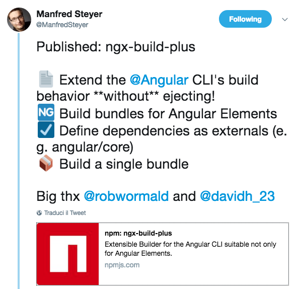

Few posts ago I described how to create an angular material data table and how to publish it as a library. As we're really proud about that, and also a bit lazy, I was wondering if it's possible to be used with other frameworks like react, vue.js and why not in pure html page. Yes Daniele, great idea! But you built it with angular, how can you aim to use that everywhere? The reply is **Custom Elements** :) For who is new to them, Custom elements are a Web Platform feature currently supported by Chrome, Opera, and Safari, and available in other browsers through polyfills. A custom element extends HTML by allowing you to define a tag whose content is created and controlled by JavaScript code. The browser maintains a CustomElementRegistry of defined custom elements (also called Web Components), which maps an instantiable JavaScript class to an HTML tag. In the latest version angular have added a new package called **@angular/elements** an API that provides a bridge from Angular's component interface and change detection functionality to the built-in DOM API. The problem, until yesterday, was that @angular/cli is not able to provide a single bundle so you need to package your "custom element" on your own. I said until yesterday because after few drinks I decided to go to sleep and on twitter I saw something like that:  First thing I tought:"Ok I'm drunk"... but after a bit I realised that it was true and the day after I decided to give a try.

As usual let's create a cli project:

ng new material-table-custom-element

We add angular material:

ng add @angular/material

And we generate our table with schematics:

ng generate @angular/material:material-table --name mat-table

Our data table is ready now, we need to add custom element support:

ng add @angular/elements
npm install @webcomponents/custom-elements --save

and export it as ngx-data-table \[gist id="a604988502b5f52475fe6a80c93b2e35"\]

Last step is to package it with the great work of Manfred:

npm install ngx-build-plus --save-dev

Change our **angular.json**:

"architect": {
"build": {
"builder": "ngx-build-plus:build",

Create a file **webpack.extra.js** with a partial webpack config that tells webpack to exclude packages like @angular/core:

\[gist id="b5be0241b0a199db0949be7cbc4810ce"\]

And finally build it:

ng build --prod --extraWebpackConfig webpack.extra.js --output-hashing none

I created a [repro on gitHub](https://github.com/daniele-zurico/angular-material-table-custom-element) in case you got lost somewhere!

If you enjoyed this post follow me [@DZurico](https://twitter.com/DZurico) ;)

## Resources:

\- https://www.npmjs.com/package/ngx-build-plus
