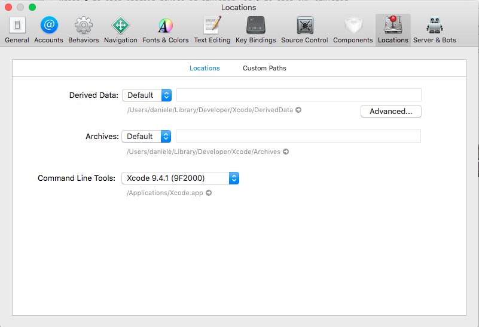
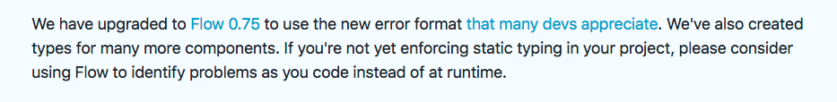

One of the things that always fascinating me but I never had the chance to try out is **React Native**. Right now I think is one of the best solution if you want to write a mobile app that works for android and apple without worries to learn swift or objective-c. So I decided to give a try and see how hard is to create something that could work and I've been really surprised on how easy it's. I honestly found a bit complicated to retrieve the right information around the web and sometimes the documentation doesn't help a lot so I decided to write down all the steps I did to have a typed prototype. This tutorial is more for mac users...unfortunately I do not have a window machine with me so I can't help out on that. The requirements to try our mobile app are:

- XCode
- Node - v8+

The first step to perform is to install CRNA (Create React Native Application) globally:

npm install -g create-react-native-app

After that we're ready to create our project:

create-react-native-app AwesomeProject

Before to install all the dependencies open Xcode and under preference > location select the **command line tools**: 

We ready to install our dependencies and run the project:

yarn install

and finally:

yarn start

If everything went well after you press **i** on the terminal you'll see the emulator opening and your mobile app showing. Cool isn't? But what about flow? And why do we need it? If you are confident with typescript, flow is "more or less" doing the same job giving you the type checking...why do we need it? Well it's always good practice to have type checking and react/ react native is moving on that direction instead using TypeProps: 

After this brief introduction let's install it and configure properly.

npm install --save-dev flow-bin

In package.json add a new entry in your scripts section:

"flow": "flow"

You can run now:

flow init

And it will generate a file called **.flowconfig**. We need to edit to work properly: \[gist id="014dca9e81f8d43295298fae1386d460"\] Now if we run:

yarn flow

We should see **0 errors**.

If you use vs-code I kindly suggest you to install [flow-for-vscode](https://github.com/flowtype/flow-for-vscode). It's a great plugin and it will give you real-time type checking that will save you a lot of time. To configure properly open your project settings and add that: \[gist id="1824bc2831a32f38252b0a62938cfad0"\] and after restarting the edit you'll see performing the type checking at runtime.

Now that your environment is up and running on top of each file you want to type check add:

// @flow

and you ready to go. Go to the [documentation](https://flow.org/en/docs/getting-started/) and learn how you can check your code and you'll become master in less time ;)

If you enjoyed my post leave a comment and follow me on twitter [@DZurico](https://twitter.com/DZurico)
