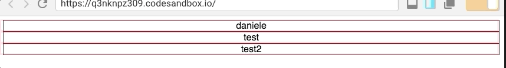

One of the biggest challenge for each developer is to create reusable components trying to hide the complexity for who will use it. Today I'll try to explain how to create an expansion panel:

I know, it's not good looking but I didn't want to add classes and animation because is not the main thing I want to show.

The most important part is that we don't need to store any state and/or action but it does everything internally. This is an example how we can use it: \[gist id="61d2815f479bb892400d6d49984842d8"\] We have:

1. **ExpansionPanel**: The container;
2. **ExpansionPanelTitle**: The title of your list. It contains whatever you want and on click  it will hide/show the content;
3. **ExpansionPanelContent**: The content (hidden by default). Also this component can contain whatever you want.

One thing that you probably realised is that you don't need to care about the click event or managing the state to show and hide the component as everything is managed internally. Some of you probably are wondering how is it possible that 3 components that are completely independent and so abstract can talk to each other? and here is where the black magic happens.

<iframe class="giphy-embed" src="https://giphy.com/embed/qeHJWaCYOc2WI" width="480" height="360" frameborder="0" allowfullscreen="allowfullscreen"></iframe>

[via GIPHY](https://giphy.com/gifs/kel-qeHJWaCYOc2WI)

Let's start from the beginning and write our components. How you can imagine we need 3 components:

1. **ExpansionPanel**;
2. **ExpansionPanelTitle**;
3. **ExpansionPanelContent**.

Let's start from the easiest one - the **ExpansionPanelContent**. 6 lines of code are more then enough: \[gist id="b9cf6f721af610b676f198e4d43d13ee"\] what we're doing here it's just saying: render whatever is passed as content (**props.children**). As you can see we do not say anything on how to show or hide it.

The **ExpansionPanelTitle, **other 6 lines of code: \[gist id="6d586c65cb9d229e793f1d39b07c39c9"\] it says pretty much the same thing of the Content, but it has the **onClick** event. Of course it doesn't say what to do but it registers the event.

As you can expect the magic happens in the **ExpansionPanel** and here surprise we need 30 lines of code to make it works. \[gist id="be8914f93bc4f4c4a6f14031a95af82e"\] First of all we need a class to store the state that shows and hide the content (line 3-5). The most important part is the **render** method and the const **childrenWithNewProps** (probably not the best name but I'm not the master on that). **Children.map** provides utilities for dealing with the this.props.children opaque data structure. The signature is:

React.Children.map(children, function\[(thisArg)\])

What we can do with it, it is checking all the children that are rendered inside this component and as you can expect it will be 2 of them: **expansionPanelContent** and **expansionPanelTitle.** The other amazing utility we have is **cloneElement**. It clones and returns a new React element using element as the starting point. The resulting element will have the original element’s props with the new props merged in shallowly. New children will replace existing children. key and ref from the original element will be preserved. the signature is:

React.cloneElement(
element,
\[props\],
\[...children\]
)

We use it because we can't apply changes to props so stuff like:

child.props.onClick = this.toggleElement

is not allowed!!!

Going back to our **Children.map** what we do is: 1) If we have the **expansionPanelContent** and  **this.state.show** is **false** we return **null** (we don't display it) otherwise we clone the element as it is. 2) If the component is **expansionPanelTitle** we attach to the **onClick** event the **toggleContent** that will change the state of show from false to true and will cause the re-render.

I hope that you enjoyed the post and in case you have a better way to implement it let me know on [twitter](https://twitter.com/DZurico) or leave a comment here. I'm still on my learning curve ;)
