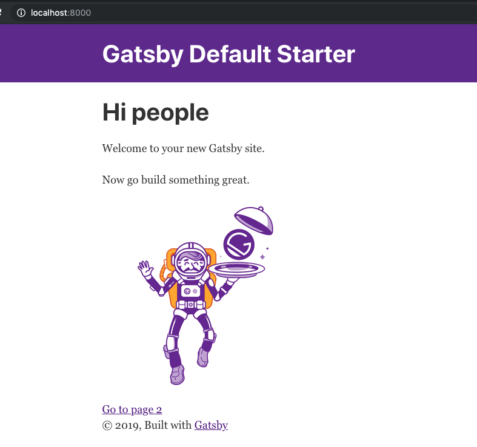
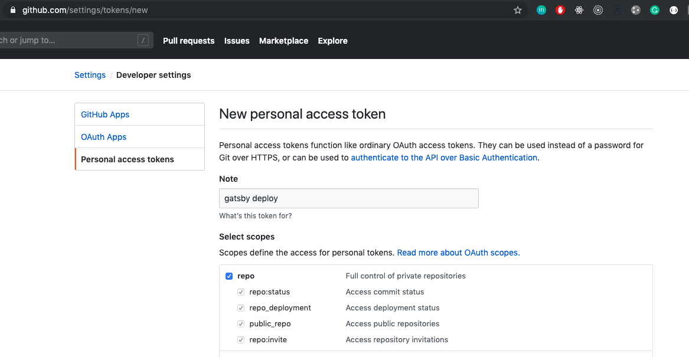

After three years of having my blog with WordPress hosted on hostgator.com, I decided that was time to have a change looking around for something cheaper and faster.

There’re plenty of options around but why not combine business with pleasure??? So, I use this opportunity to learn how to use GitHub actions, Github pages, gatsby and having my new blog for free (Ok I need a domain but guys we need to pay something :) )

I’m pretty sure that some of you already did it but to be honest I didn’t find exhaustive documentation so … here we are.

Let’s start creating a new repository on GitHub: [https://github.com/new](https://github.com/new)


It’s time to move to our machine and create a local project.

If you don’t have GatsbyJs installed globally open your terminal and run:

```
npm install -g gatsby-cli
```

and generate your Gatsby blog locally:

```
gatsby new daniele-zurico.github.io
```

If you are already curious to know what’s going on, you can run:

```
yarn develop
```

And open your browser on localhost:8080:



Ok, we made the first step … now we need to publish our blog to our fresh repository. Open again your terminal and run:

```
git remote add origin git@github.com:daniele-zurico/daniele-zurico.github.io.git
```

We need to create a new branch that will contain our source code:

```
git checkout -b gh-pages
git add –all
git commit -m ‘initial commit’
git push --set-upstream origin gh-pages
```

Our code is safe and stored in our fresh repository:


Now the complicated part ... How we let GitHub actions to deploy our code? There’re a few steps to do but if you follow me it will be quite easy to configure. Go to:

[https://github.com/settings/tokens](https://github.com/settings/tokens)

And press Generate new token:



Don’t tick the other options because they’re not needed. When you press **generate token** you’ll get a long string, copy it and save to your notes.

Now we can go back to our project and in "settings/secrets" add the new secret using the same name in the screenshot and pasting the value that you got from the previous action:


After pressing “Add secret” you’ll see this result:


It’s time to configure our GitHub-actions… it’s still in beta so you need to apply for it ooor wait until the 13th of November and will be available for the public.


If you’re using already Github actions you’ll see a tab called actions:


Click on Setup this workflow and paste this content:

[https://github.com/daniele-zurico/daniele-zurico.github.io/blob/gh-pages/.github/workflows/main.yml](https://github.com/daniele-zurico/daniele-zurico.github.io/blob/gh-pages/.github/workflows/main.yml)


And finally, press “Start commit”.

It’s time to move back to our local project and in the terminal run:

```
git pull
```


Let’s apply a small change to our index.js:

```js
Welcome to your new Gatsby site with Github actions.
```

and push the new changes:

```
git add –all
git commit -m ‘first change’
git push
```

If we go back to our GitHub repo and we click on the "action" the magic is happening:


After a couple of minutes, it should be green, and it means that the deployment is done:


If you look in the code tab a master branch has been created:


And clicking on settings you’ll see a green tick with your new fresh blog with CI/CD:


From now all the time you’ll push something to your "gh-pages" branch it will be automatically deployed.

Next step? Move all the posts I’ve on WordPress to Gatsby :D

If you find something not correct please feel free to comment below.

Follow me on twitter [@DZurico](https://twitter.com/DZurico)
